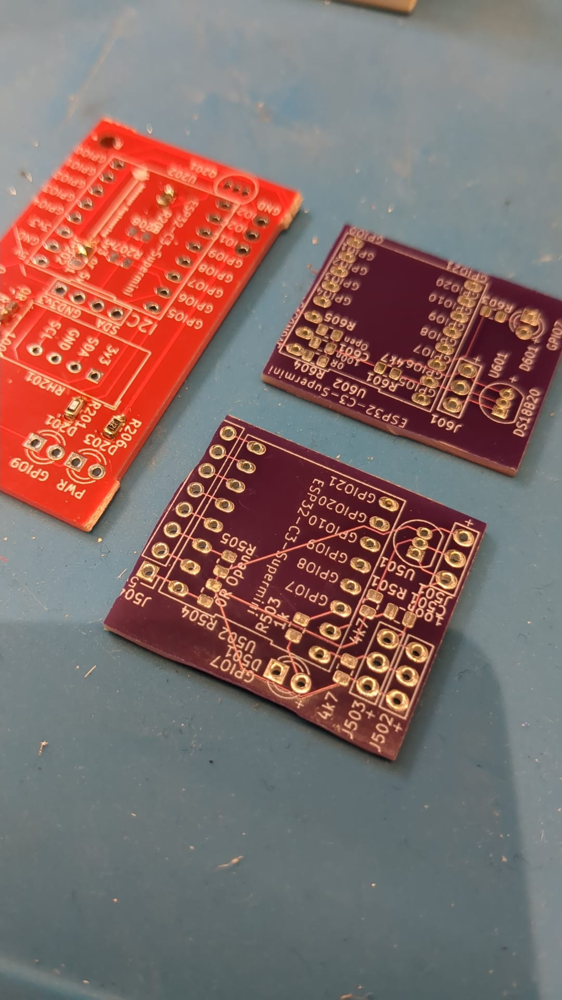
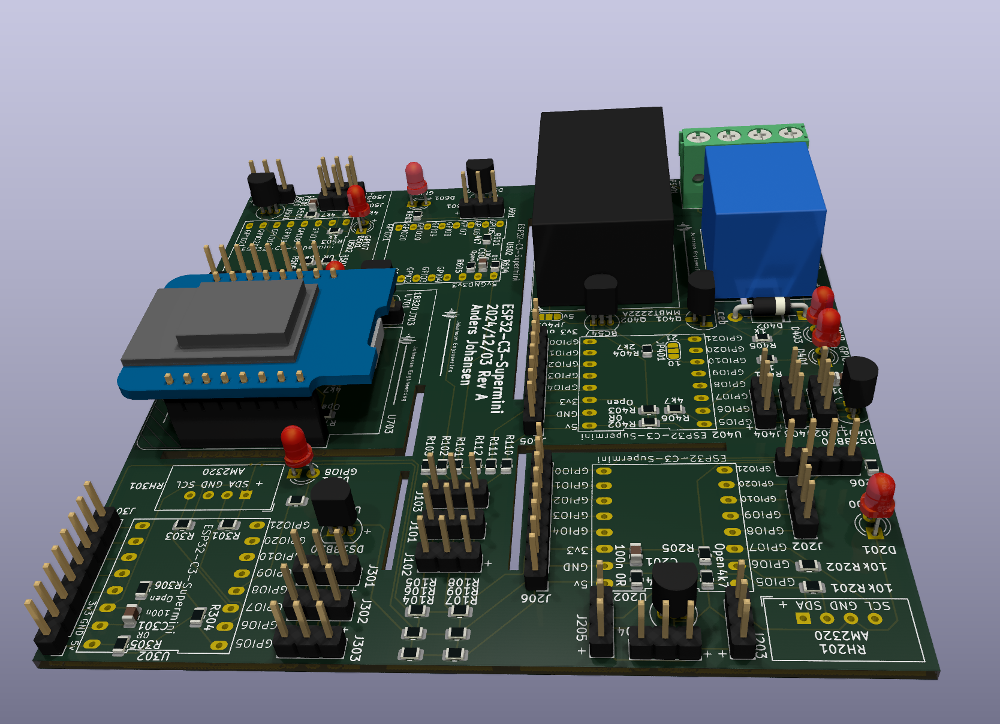

# HomeAutomationESP32C2mini_2024
 Kicad 8

# Purpose
Use for testing ESP32 C3 as replacement for ESP 8266 in ESP Home config

| ESP Designation  | Pin | Use |
| ------------- | ------------- | ------------- |
| U201 ESP32 C3 |  |   |
| U301 ESP32 C3 |  |   |
| U401 ESP32 C3 |  |   |
| U501 ESP32 C3 |  |   |
| U601 ESP32 C3 |  |   |
| U701 ESP8266 | D1 | SCL AM2320 |
| U701 ESP8266 | D2 | SDA AM2320 |
| U701 ESP8266 | D3 / GPIO0| LED |
| U701 ESP8266 | D4 / GPIO2| 18B20 / Onboard LED|

# Status - Preliminary mounted
## Initial 
| Stage  | Detail | Status |
| ------------- | ------------- | ------------- |
| create material  | sch/pcb | OK  |
| | gerber | OK |
| production  |   | ok |
|  | produced | ok |
|  | delivered | ok |
## Preliminary validation
| Test  | Detail | Status |
| ------------- | ------------- | ------------- |
| Initial Inspection | | OK |
| Initial Technical Test |  |  |
| Initial Technical Test |  |  |
| Initial Technical Test |  |  |
| Initial Product Test |  |  |
| Initial Product Test |  |  |
| Initial Product Test |  |  |
| Power Draw |  |  |
| Power Draw |  |  |
| Power Draw |  |  |

## Secondary validation
| Test  | Detail | Status |
| ------------- | ------------- |------------- |
| Product Test |  | |
| Product Test |  |  |
| Quality | | |
| Quality | | |
| Long Term Product Test |  |  |
| Power Draw |  |  |
| Power Draw |  |  |
| Power Draw |  |  |

## Errata
### Errata - Sub 1
### Errata - Sub 2
### Errata - Sub 3

## Issues and Notes
### Sub 1
### Sub 2

# Pictures

# Inspiration
## ATMega 32A
https://github.com/MCUdude/MightyCore
